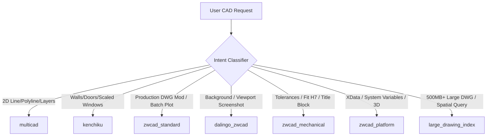

# CAD-MCP Agent Instruction & Governance Rules

This document outlines the strict behavioral principles, tool routing policies, and execution protocols for AI Agents operating with `CAD-MCP`.

---

## 1. Core Operating Principles

1. **Verification Over Speculation**:
   - Never report a CAD operation as `PASS` without verifying the resulting geometry, layer, or entity count via query or visual screenshot.
2. **Context Synchronization on Every Transition**:
   - When switching between providers (e.g. from `multicad` to `kenchiku`), re-query active document path and entity handles. Never assume internal IDs are interchangeable.
3. **Strict Single-Writer Serialization**:
   - Never issue concurrent write requests across multiple CAD providers on the same drawing.
4. **Safety-First for Existing DWGs**:
   - When editing existing production DWGs, always use two-phase dry-run (`dry_run=true` $\rightarrow$ inspect $\rightarrow$ `confirm=true`) or verify Undo Mark boundaries.

---

## 2. Capability Routing Map

When fulfilling user CAD requests, route to the primary provider only after independent host/fixture verification. The following map is an unverified design proposal, not a benchmark result:



---

## 3. Closed-Loop Agent QA Workflow

For any complex drafting task, follow the **6-Step Quality Loop**:

```text
1. PLAN          : Inspect active drawing extents, layers, and coordinate bounds.
2. PREVIEW       : Run write operation with dry_run=true (if supported) to inspect parameters.
3. EXECUTE       : Perform mutation on designated layer.
4. QUERY         : Query entity count, handle, and coordinates to verify geometry.
5. VISUAL CHECK  : Capture viewport screenshot (dalingo_zwcad.view or window grab).
6. FINALIZE      : Save DWG / Export PDF and report clean summary.
```

---

## 4. Error Handling & Recovery Rules

- **COM Busy / Pending**: If CAD returns `-2147417846` (busy with modal dialog), pause 500ms and retry up to 3 times.
- **Missing Block Definition**: If block insert fails because block is undefined in drawing, create block definition or draw geometric equivalent.
- **Rollback on Error**: If a multi-step drafting operation fails halfway, immediately trigger `undo` to return drawing to initial baseline state before reporting failure to user.
