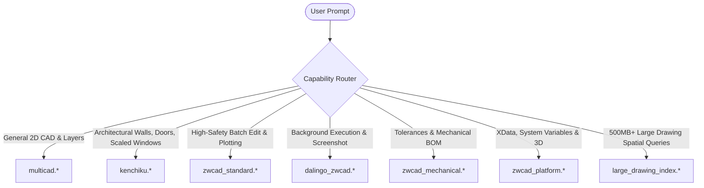

> Evidence correction: historical PASS rates, scores, rankings and performance claims in this document are unverified legacy assumptions (LEGACY_SYNTHETIC). They are not candidate MCP execution evidence. Do not use them to authorize execution.

# CAD-MCP Codex & Agent Handoff Guide

Operational guide for Codex, Claude, Antigravity, and AI Agents to effectively control CAD-MCP tools across independent providers on ZWCAD.

---

## 1. Operating Rules for Agents

### Rule 1: Always Re-verify Active Document Context Before Writing
When starting a task or switching between provider tools, NEVER assume the active document or selection hasn't changed.
```text
Step 1: Check active document (e.g. multicad.manage_session or zwcad_standard.get_current_document)
Step 2: Verify drawing path and unit system (INSUNITS)
Step 3: Query target entity handles before mutating
Step 4: Execute mutation
Step 5: Query state back to confirm success
```

### Rule 2: Single-Writer Lock Principle
Never invoke write tools from multiple providers concurrently on the same drawing. All writes must be serialized.

### Rule 3: Use the Capability Leader for Specialized Operations
Refer to `registry/providers.json` for optimal capability routing:



---

## 2. Tool Invocation Recipes

### A. Non-Uniform Architectural Block Scaling (`kenchiku`)
To insert an architectural window sash with custom width ($X=4.213$) and standard depth ($Y=1.0$):
```json
{
  "operation": "insert",
  "block_name": "WIN_1800",
  "insertion_point": [3100, 5800, 0],
  "scale": "4.213x1.0",
  "rotation": 0,
  "layer": "WIN"
}
```

### B. High-Safety Batch Write & Undo Guard (`zwcad_standard`)
Always preview changes first with `dry_run=true`:
```json
// Step 1: Preview
{
  "entities": [
    {
      "entity_type": "lwpolyline",
      "layer": "WAL1",
      "params": {
        "vertices": [[0, 0], [8000, 0], [8000, 6000], [0, 6000]],
        "closed": true
      }
    }
  ],
  "dry_run": true
}

// Step 2: Confirm and Execute
{
  "entities": [
    {
      "entity_type": "lwpolyline",
      "layer": "WAL1",
      "params": {
        "vertices": [[0, 0], [8000, 0], [8000, 6000], [0, 6000]],
        "closed": true
      }
    }
  ],
  "dry_run": false,
  "confirm": true
}
```

### C. Visual Evidence Loop (`dalingo_zwcad`)
Capture background CAD viewport as PNG to visually confirm drawing geometry:
```json
{
  "tool": "dalingo_zwcad.view",
  "arguments": {
    "operation": "get_screenshot"
  }
}
```

### D. Deep Metadata & System Variable Query (`zwcad_platform`)
```json
{
  "tool": "zwcad_platform.get_variable",
  "arguments": {
    "name": "INSUNITS"
  }
}
```

### E. Large Drawing Subsecond Spatial Query (`large_drawing_index`)
Find all equipment blocks within 5000mm radius of point `(12000, 8500)`:
```json
{
  "tool": "large_drawing_index.blocks_near",
  "arguments": {
    "point": [12000, 8500],
    "radius": 5000
  }
}
```

---

## 3. Error Recovery Patterns

1. **COM Busy Error (`-2147417846` / `0x8001010A`)**:
   - Cause: ZWCAD is currently inside a modal dialog (e.g. font substitution, plot setup) or user is panning.
   - Action: Retry after 500ms with exponential backoff up to 3 times.

2. **Entity Handle Not Found**:
   - Cause: Entity deleted by prior operation or active document switched.
   - Action: Call `get_objects_in_model` or `query_entities` to refresh valid handles.

3. **Scale String Format Error**:
   - Use format `<x>x<y>` (e.g. `"4.213x1.0"`) or standard float for uniform scaling.
